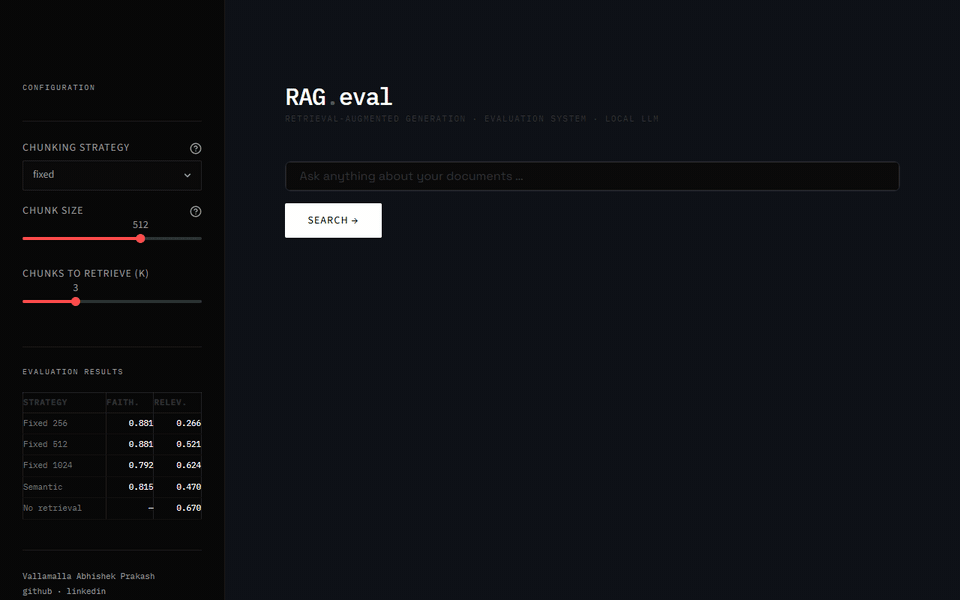

# RAG Evaluation System

A local Retrieval-Augmented Generation (RAG) pipeline built to compare chunking strategies and score their answers with RAGAs.



*The Streamlit app answering question q01 from the evaluation set with fixed 512-character chunks, recorded from the running app with Mistral already loaded. The wait of about 6 seconds for the answer is cut to about 2 seconds.*

---

## What This Project Does

Most RAG tutorials stop at "it works." This project asks how well it works, and why.

The system ingests a folder of documents, chunks them with different strategies, embeds the chunks into a FAISS vector store, and answers questions with a local LLM. Chunk size and chunking strategy are treated as experimental variables, and an evaluation harness scores each configuration on the same questions.

---

## Evaluation Results

The corpus is the OCPP 1.6 edition 2 specification and the OCPP-J 1.6 specification, committed in `data/corpus/` (licence in `data/corpus/NOTICE.md`). The 28 questions in `evaluation/eval_set.json` are 12 lookups, 6 cross-section, 5 multipart and 5 labelled unanswerable, each with a ground-truth answer.

Each configuration retrieves the top 3 chunks and answers with Mistral 7B (`mistral:latest`, Q4_K_M) through Ollama. Answers are scored with RAGAs 0.4.3 faithfulness and answer relevancy; the same local Mistral model is the judge, and answer relevancy also uses all-MiniLM-L6-v2 embeddings. The last row is a baseline: the bare question goes to the same model with no retrieval and no context.

| Configuration | Chunks | Faithfulness | Answer relevancy |
|---|---|---|---|
| Fixed, 256 characters, 32 overlap | 1,317 | 0.881 | 0.266 |
| Fixed, 512 characters, 64 overlap | 653 | 0.881 | 0.521 |
| Fixed, 1024 characters, 128 overlap | 344 | 0.792¹ | 0.624 |
| Semantic, 95th percentile breakpoints | 1,017 | 0.815 | 0.470 |
| No retrieval (baseline) | none | not meaningful² | 0.670 |

¹ Mean of 26 of the 28 questions. RAGAs could not parse the judge's faithfulness output for q02 and q15.

² The baseline has no context to be faithful to, yet RAGAs returned 0.940. That measures the judge, not the answers.

These are means from one run on 2026-09-14, which took 5 h 28 min on a 4 GB GTX 1050 Ti. No repeat runs were made, so run-to-run variance is unmeasured. The summary scores are in `evaluation_results.json`, written by `evaluation/run_eval.py`. Every answer, its retrieved chunks and its per-question scores are in `evaluation/per_question_results.json`, which was exported from the RAGAs result tables by a wrapper around that run; `run_eval.py` itself does not write it.

The recorded semantic row in both files carries `chunk_overlap: 64`. That is a phantom value the code wrote at the time of the run, fixed in the code afterwards; it had no effect, since semantic chunking never reads an overlap setting. The results files are left as the run wrote them.

### Correctness grading

Both RAGAs metrics rank the no-retrieval baseline above every retrieval configuration. Because neither metric compares answers to the ground truth, all 140 answers (28 questions × 5 configurations) were also graded against the reference answers by two LLM panels. Both panels were the same model, Claude Opus 5 (`claude-opus-5`), run twice with the same rubric and a different instruction each, which is weaker evidence than two different models. The panels ran without seeing each other's grades, but they were not blind to configuration: each grader saw all five answers to a question labelled by configuration, with the retrieved chunks and the RAGAs scores. They agreed on 138 of 140 grades. The no-retrieval baseline was graded correct on 0 of 23 answerable questions; fixed 1024 was graded correct on 10 or 11 of 23, the two panels differing on one item (q10). One panel's instruction named failure patterns already seen in baseline answers, such as descriptions of other protocols; the other panel's did not, and both graded the baseline 0 of 23. These grades come from a model, not people, and are reported for the direction of the difference rather than as exact accuracy. The rubric, both instructions and every grade are in `evaluation/answer_grades.json`.

I also graded 46 answers myself: the 23 answerable questions for the no-retrieval baseline and for fixed 1024. I graded the baseline correct on 0 of 23 and fixed 1024 on 11 of 23, agreeing with the two model panels on 41 and 42 of 46. Answer relevancy ranks that same baseline highest of all five configurations. The blinding was partial: I had read the panel totals beforehand, and an answer's wording can reveal whether retrieval was used. Where I differed from a panel, it was on the boundary between two grades: three on partial against correct, one on incorrect against declined, and one where I gave a baseline answer partial credit that both panels called incorrect. None of my differences graded a baseline answer correct, so the 0 of 23 result is unaffected. My grades are in `evaluation/manual_grades.json`.

### How to read these numbers

- **The baseline's high answer relevancy does not mean retrieval hurts.** Answer relevancy scores whether an answer addresses the question, not whether it is correct, and an answer can address the question and still be wrong. Asked which fields BootNotification.req requires (q02), the baseline describes the ACPI firmware specification; with retrieval, fixed 512 names `idTagInfo` and fixed 1024 names BootNotification.conf fields, yet they score 0.693 and 0.729.
- **On the five questions labelled unanswerable, the baseline scores 0.836.** In three of them (q24, q25, q28) it states timeouts in seconds that the specification does not define (q24: "up to 15 seconds"). Every retrieval configuration says the context does not specify on four of the five, all except q26, and averages 0.000 on the five, except fixed 1024 (0.313).
- **On the 23 answerable questions alone, the gaps are not conclusive.** The baseline scores 0.634: above fixed 256 (0.324) and semantic (0.572), level with fixed 512 (0.634) and below fixed 1024 (0.691). A bootstrap 95% interval for fixed 1024 minus the baseline on these questions runs from −0.12 to +0.23.
- **Declining an answer usually scores zero.** RAGAs asks the judge whether an answer is noncommittal and sets answer relevancy to 0 when all three of its judgements say so. Of the 33 answers that open with "The context does not" or a close variant, 31 scored 0; fixed 512's q12 (0.659) and fixed 1024's q28 (0.742) did not. Answers scored exactly 0: 18 for fixed 256, 9 for fixed 512, 6 for fixed 1024, 12 for semantic and 2 for the baseline. 16 of those 47 are not such declines; fixed 256's q17, for example, names a field that StopTransaction.req does not have. Small chunks can cut field tables short: for q02 and q03, the top fixed 256 chunk ends at the table's header row, before the fields.
- **Faithfulness is weak evidence here.** The same judge gave 24 of the 28 empty-context baseline answers a perfect 1.0, so the retrieval rows' faithfulness scores carry little weight. Fixed 256 and fixed 512 differ by less than 0.001.
- **The fixed rows do not isolate chunk size.** Overlap grows with chunk size and every configuration retrieves 3 chunks, so larger chunks also give the model more context.
- **Neither metric checks answers against the ground truth.** The ground-truth answers are passed to RAGAs, but faithfulness and answer relevancy do not use them. A correctness metric would be needed to rank configurations by accuracy.

---

## Pipeline Overview

```
Raw Documents (PDF, TXT, MD, HTML)
        ↓
   Document Loader          ← chosen by file extension, with source file metadata
        ↓
   Chunking Strategies      ← fixed / semantic (with configurable parameters)
        ↓
   Embedding Model          ← sentence-transformers (all-MiniLM-L6-v2)
        ↓
   FAISS Vector Store       ← persisted locally with full metadata
        ↓
   Similarity Retrieval     ← top-k most relevant chunks
        ↓
   LLM Answer Generation    ← Mistral 7B via Ollama (local)
        ↓
   Source Attribution       ← lists the source files of the retrieved chunks
```

---

## Current Features

1) **Multi-format document loading:** PDF, TXT, MD and HTML, chosen by file extension (`.pdf`, `.txt`, `.md`, `.html`)
2) **Configurable chunking:** fixed-size with overlap, plus semantic boundary detection
3) **Local embeddings:** sentence-transformers, no API costs
4) **FAISS vector search:** similarity retrieval with a persisted index
5) **Local LLM inference:** Mistral 7B via Ollama, running on your machine
6) **Source attribution:** every answer lists the files of the chunks retrieved for it
7) **Streamlit app:** ask questions and preview the retrieved chunks (first 380 characters, with file and page) in a browser

---

## Chunking Strategies Implemented

| Strategy | How it works | Configuration |
|---|---|---|
| **Fixed-size** | Splits text into chunks of up to N characters, with up to K characters of overlap | `chunk_size=512, chunk_overlap=64` |
| **Semantic** | Splits where the meaning shifts, using embeddings | `breakpoint_threshold=95` (percentile) |

---

## Project Structure

```
rag-eval-system/
├── app/
│   └── streamlit_app.py    # browser UI for questions and retrieved chunks
├── ingestion/
│   ├── loader.py           # multi-format document loading
│   ├── chunker.py          # fixed + semantic chunking strategies
│   └── embedder.py         # sentence-transformer embeddings + FAISS
├── retrieval/
│   ├── retriever.py        # vector similarity search
│   └── generator.py        # LLM answer generation with Ollama
├── evaluation/
│   ├── metrics.py          # RAGAs evaluation (faithfulness, answer relevancy)
│   ├── run_eval.py         # runs the four chunking configurations and the no-retrieval baseline
│   ├── eval_set.json       # 28 questions with ground-truth answers
│   ├── per_question_results.json  # answers, retrieved chunks and scores from the published run
│   ├── answer_grades.json  # LLM-panel correctness grades of those answers
│   └── manual_grades.json  # the author's own grades of 46 of those answers
├── data/corpus/            # OCPP 1.6 specification PDFs used by the evaluation
├── docs/demo.gif           # app demo shown above
├── evaluation_results.json # summary scores from the published run
├── vectorstore_*/          # persisted FAISS indexes (not tracked)
└── requirements.txt
```

---

## Tech Stack

- **LangChain:** document loaders, text splitters, and FAISS, embedding and Ollama wrappers
- **Sentence-Transformers:** all-MiniLM-L6-v2 embeddings
- **FAISS:** vector similarity search (CPU)
- **Ollama + Mistral 7B:** local LLM inference and evaluation judge
- **RAGAs:** faithfulness and answer relevancy metrics
- **Streamlit:** browser UI
- **Python 3.10+**

---

## Installation & Usage

### Prerequisites
- Python 3.10 or higher
- [Ollama](https://ollama.com/download) installed with the Mistral model

### Setup

```bash
# Clone the repo
git clone https://github.com/vabhishekprakash/rag-eval-system.git
cd rag-eval-system

# Install dependencies
pip install -r requirements.txt

# Download Mistral model (one-time, ~4GB)
ollama pull mistral
```

The first run of the pipeline, the app or the evaluation also downloads the all-MiniLM-L6-v2 embedding model (about 90 MB) from Hugging Face.

### Documents

The evaluation and the app read the OCPP specification PDFs committed in `data/corpus/`.

To try the pipeline on your own documents, put PDF, TXT, MD or HTML files in a `data/raw/` folder in the project root. This folder is listed in `.gitignore`, so its files are not added to commits by default.

```bash
mkdir -p data/raw
```

### Run the Pipeline

```python
from ingestion.loader import load_documents
from ingestion.chunker import get_chunks
from ingestion.embedder import build_vectorstore
from retrieval.retriever import retrieve_context
from retrieval.generator import generate_answer

# Load and process documents
docs = load_documents('data/raw')
chunks = get_chunks(docs, strategy='fixed', chunk_size=512)
vectorstore = build_vectorstore(chunks)

# Ask a question
query = "What is the main topic of these documents?"
context = retrieve_context(query, vectorstore, k=3)
result = generate_answer(query, context)

print(f"Answer: {result['answer']}")
print(f"Sources: {result['sources']}")
```

### Run the Evaluation

From the project root:

```bash
python evaluation/run_eval.py
```

This builds one vector store per configuration, answers the questions in `evaluation/eval_set.json`, adds the no-retrieval baseline, scores everything with RAGAs and writes `evaluation_results.json`. Judge calls run one at a time because the Ollama server used for the published run handled one request at a time (`OLLAMA_NUM_PARALLEL=1`); that run took 5 h 28 min on a 4 GB GTX 1050 Ti.

### Run the App

```bash
streamlit run app/streamlit_app.py
```

---

## Why This Project Matters

Retrieval quality decides how good a RAG system's answers are, yet most implementations treat chunking as a one-line decision. This project treats it as an experiment: it measures how chunking strategy and chunk size affect RAGAs faithfulness and answer relevancy on the same set of questions.

---

## Technical Decisions

**Local LLM over an API:**
No rate limits, no costs and full privacy. The same local model also acts as the RAGAs judge, so the evaluation needs no API key either. The trade-off shows in the results: a 7B judge scored the no-context baseline 0.940 on faithfulness.

**FAISS over a vector database:**
Simplicity and portability. The whole vector store is a few files that can be versioned and moved, with no server to run.

**sentence-transformers over OpenAI embeddings:**
Local, free and reproducible. `all-MiniLM-L6-v2` is small (about 90 MB) and runs on CPU.

---

## Author

**Vallamalla Abhishek Prakash**
B.Tech CSE (AI & ML), final year
[GitHub](https://github.com/vabhishekprakash) · [LinkedIn](https://www.linkedin.com/in/vallamalla-abhishek-prakash)

---

## License

Code: MIT License. See [LICENSE](LICENSE).

The OCPP specification PDFs in `data/corpus/` are published by the Open Charge Alliance under CC BY-ND 4.0. See [data/corpus/NOTICE.md](data/corpus/NOTICE.md).
